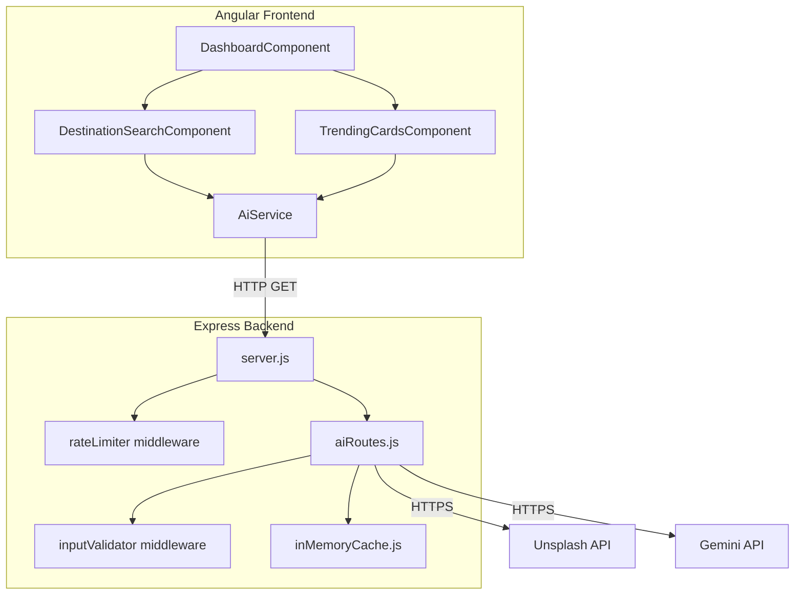

# Design Document: AI Travel Enhancements

## Overview

This document describes the technical design for adding four AI-powered features to the existing Travel Itinerary Planner (MEAN stack). All external API calls are proxied through the Express backend to keep API keys server-side. The four features are:

1. **Destination Image Auto-Fetch** — Unsplash API, `GET /api/image?place={destination}`
2. **AI Place Autocomplete Suggestions** — Gemini API, `GET /api/suggestions?q={query}`
3. **Trending Destinations** — Gemini API, `GET /api/trending`
4. **Smart Itinerary Attraction Suggestions** — Gemini API, `GET /api/itinerary-suggestions?place={destination}`

Supporting concerns: API proxy security, input validation/sanitization, in-memory caching, and rate limiting.

### Key Design Decisions

- **No new npm packages for rate limiting or caching**: implemented with plain Node.js `Map` objects and `Date.now()` to keep the dependency footprint minimal. `node-fetch` (or the built-in `fetch` available in Node 18+) is used for outbound HTTP calls.
- **Gemini REST API over SDK**: the `@google/generative-ai` SDK is optional; the design uses the Gemini REST endpoint directly to avoid adding a heavy dependency. If the project already has Node 18+, `fetch` is built-in.
- **Single AI routes file**: all four new endpoints live in `server/routes/aiRoutes.js` to keep the existing route files untouched.
- **Angular service isolation**: a dedicated `AiService` in the frontend encapsulates all four AI endpoint calls, keeping `ApiService` focused on CRUD.
- **Standalone Angular components**: new UI components follow the existing pattern (standalone, Tailwind CSS, Material Symbols icons).

---

## Architecture



### Request Flow

1. User types in `DestinationSearchComponent` → debounce 400 ms → `AiService` calls backend proxy.
2. Express `rateLimiter` middleware checks per-IP request count (60 req/min window).
3. `inputValidator` middleware validates and sanitizes query parameters.
4. Route handler checks in-memory cache; on hit returns cached value with `X-Cache: HIT`.
5. On cache miss, route handler calls external API, stores result, returns with `X-Cache: MISS`.

---

## Components and Interfaces

### Backend

#### `server/middleware/rateLimiter.js`

```js
// Exports Express middleware: rateLimiter
// Uses a Map<ip, {count, windowStart}> to track requests per IP.
// Window: 60 seconds, limit: 60 requests.
// On exceed: 429 + Retry-After header.
```

#### `server/middleware/inputValidator.js`

```js
// Exports: validateQueryParam(paramName, maxLength = 200)
// Returns Express middleware that:
//   1. Checks param exists and is non-empty.
//   2. Validates only printable Unicode characters (regex: /^[\x20-\x7E\u00A0-\uFFFF]+$/).
//   3. Checks length <= maxLength.
//   4. Strips HTML tags and <script> content via regex.
//   5. On failure: 400 + descriptive message.
//   6. On success: attaches sanitized value to req.sanitized[paramName].
```

#### `server/utils/inMemoryCache.js`

```js
// Exports: class InMemoryCache
//   constructor(defaultTtlMs)
//   get(key): value | null
//   set(key, value, ttlMs?)
//   has(key): boolean
// Backed by Map<string, {value, expiresAt}>
// TTL defaults: image/suggestions = 1 hour, trending = 24 hours, itinerary-suggestions = 1 hour
```

#### `server/routes/aiRoutes.js`

Four route handlers, all using `rateLimiter` and `inputValidator`:

| Route | Method | Middleware | External API |
|---|---|---|---|
| `/api/image` | GET | rateLimiter, validateQueryParam('place') | Unsplash |
| `/api/suggestions` | GET | rateLimiter, validateQueryParam('q') | Gemini |
| `/api/trending` | GET | rateLimiter | Gemini |
| `/api/itinerary-suggestions` | GET | rateLimiter, validateQueryParam('place') | Gemini |

Each handler:
1. Checks cache → returns `{ data, source: 'cache' }` with `X-Cache: HIT`.
2. Calls external API.
3. Parses and validates response shape.
4. Stores in cache.
5. Returns `{ data }` with `X-Cache: MISS`.

#### Unsplash API call (image route)

```
GET https://api.unsplash.com/search/photos?query={place}&per_page=1&orientation=landscape
Authorization: Client-ID {UNSPLASH_ACCESS_KEY}
```

Response shape extracted: `results[0].urls.regular` (string URL).

#### Gemini API call (suggestions, trending, itinerary-suggestions)

```
POST https://generativelanguage.googleapis.com/v1beta/models/gemini-2.0-flash:generateContent?key={GEMINI_API_KEY}
Content-Type: application/json
Body: { "contents": [{ "parts": [{ "text": "<prompt>" }] }] }
```

Prompts:
- **suggestions**: `"Suggest up to 8 real place names matching '{query}'. Return ONLY a JSON array of strings, no markdown."`
- **trending**: `"Suggest 5 trending travel destinations in 2026 with short descriptions. Return ONLY a JSON array of objects with fields name (string) and description (string, max 100 chars), no markdown."`
- **itinerary-suggestions**: `"Suggest top 5 attractions in {destination} for a travel itinerary. Return ONLY a JSON array of objects with fields name (string) and description (string, max 150 chars), no markdown."`

Gemini response parsing: extract `candidates[0].content.parts[0].text`, then `JSON.parse()`. Wrap in try/catch; on parse failure return 502.

### Frontend

#### `frontend/src/app/services/ai.service.ts`

```typescript
@Injectable({ providedIn: 'root' })
export class AiService {
  getDestinationImage(place: string): Observable<{ url: string }>
  getSuggestions(query: string): Observable<string[]>
  getTrendingDestinations(): Observable<TrendingDestination[]>
  getItinerarySuggestions(place: string): Observable<Attraction[]>
}
```

Interfaces:
```typescript
export interface TrendingDestination { name: string; description: string; }
export interface Attraction { name: string; description: string; }
```

All methods call `environment.apiUrl + '/api/...'` via `HttpClient`. Errors are propagated as `Observable` errors for components to handle.

#### `frontend/src/app/components/destination-search/destination-search.component.ts`

Standalone component embedded in `DashboardComponent`. Responsibilities:
- Text input with 400 ms debounce (using `Subject` + `debounceTime` from RxJS).
- Triggers `AiService.getDestinationImage()` and `AiService.getSuggestions()` on input.
- Triggers `AiService.getItinerarySuggestions()` on destination selection.
- Emits `destinationSelected: EventEmitter<string>` for parent to consume.
- Manages loading, error, and empty states for image preview, suggestion dropdown, and attraction list.
- Keyboard navigation in suggestion dropdown (ArrowUp/ArrowDown/Enter/Escape).
- Input validation: printable characters only, max 200 chars (client-side guard before API call).

#### `frontend/src/app/components/trending-cards/trending-cards.component.ts`

Standalone component embedded in `DashboardComponent`. Responsibilities:
- Calls `AiService.getTrendingDestinations()` on `ngOnInit`.
- Renders one card per destination (name + description).
- On card click: emits `destinationSelected: EventEmitter<string>`.
- Shows loading skeleton and error state.

#### `DashboardComponent` changes

- Imports and embeds `DestinationSearchComponent` and `TrendingCardsComponent`.
- Listens to `destinationSelected` events from both child components to populate the itinerary creation form's `destination` field.
- Handles 429 responses globally via `HttpInterceptor` or locally in `AiService` to display a user-readable retry message.

---

## Data Models

### Cache Entry (in-memory, server-side)

```typescript
interface CacheEntry<T> {
  value: T;
  expiresAt: number; // Date.now() + ttlMs
}
```

### API Response Shapes

**Image response** (`GET /api/image`):
```json
{ "url": "https://images.unsplash.com/photo-..." }
```

**Suggestions response** (`GET /api/suggestions`):
```json
{ "suggestions": ["Paris, France", "Phuket, Thailand", ...] }
```

**Trending response** (`GET /api/trending`):
```json
{
  "destinations": [
    { "name": "Kyoto, Japan", "description": "Ancient temples and cherry blossoms." },
    ...
  ]
}
```

**Itinerary suggestions response** (`GET /api/itinerary-suggestions`):
```json
{
  "attractions": [
    { "name": "Eiffel Tower", "description": "Iconic iron lattice tower on the Champ de Mars." },
    ...
  ]
}
```

**Error response** (all routes):
```json
{ "message": "Descriptive error message here." }
```

### Environment Variables (`.env`)

```
UNSPLASH_ACCESS_KEY=<your_unsplash_access_key>
GEMINI_API_KEY=<your_gemini_api_key>
```

---

## Correctness Properties

*A property is a characteristic or behavior that should hold true across all valid executions of a system — essentially, a formal statement about what the system should do. Properties serve as the bridge between human-readable specifications and machine-verifiable correctness guarantees.*

### Property 1: Input validation rejects invalid query parameters

*For any* query parameter string that contains HTML tags, script content, or characters outside the printable Unicode range, or that exceeds 200 characters, the `inputValidator` middleware SHALL reject the request with a 400 response and SHALL NOT forward the request to any external API.

**Validates: Requirements 5.2, 5.3, 5.4**

---

### Property 2: Cache round-trip consistency for image URLs

*For any* valid place name, the image URL stored in the cache after a live Unsplash API call SHALL be structurally identical to the URL returned directly by the Unsplash API for the same place name. A subsequent cache-hit request for the same place name SHALL return the same URL.

**Validates: Requirements 7.1, 1.8**

---

### Property 3: Cache round-trip consistency for suggestions

*For any* valid query string, the suggestion list stored in the cache after a live Gemini API call SHALL be structurally identical to the list returned directly by the Gemini API for the same query. A subsequent cache-hit request for the same query SHALL return the same list.

**Validates: Requirements 7.2, 2.10**

---

### Property 4: Cache header invariant

*For any* API endpoint request, if the response was served from cache the response SHALL include the header `X-Cache: HIT`, and if the response was fetched live from an external API the response SHALL include the header `X-Cache: MISS`. These two values are mutually exclusive for any single response.

**Validates: Requirements 7.3, 7.4**

---

### Property 5: Rate limiter enforces per-IP request cap

*For any* client IP address, after exactly 60 requests within a 60-second window, the 61st and all subsequent requests within that window SHALL receive a 429 response with a `Retry-After` header. Requests from a different IP address within the same window SHALL not be affected.

**Validates: Requirements 6.1, 6.2**

---

### Property 6: Suggestion count bounds

*For any* valid query of at least 2 characters, the Suggestion_Service SHALL return a list containing between 1 and 8 suggestions (inclusive). An empty result set is only valid when the external API returns no matches.

**Validates: Requirements 2.2**

---

### Property 7: Trending destination structure invariant

*For any* successful response from `/api/trending`, the response SHALL contain exactly 5 destination objects, each with a non-empty `name` field and a `description` field of no more than 100 characters.

**Validates: Requirements 3.2**

---

### Property 8: Itinerary attraction structure invariant

*For any* valid place name, a successful response from `/api/itinerary-suggestions` SHALL contain exactly 5 attraction objects, each with a non-empty `name` field and a `description` field of no more than 150 characters.

**Validates: Requirements 4.2**

---

## Error Handling

### Backend

| Scenario | HTTP Status | Response Body |
|---|---|---|
| Invalid/missing query param | 400 | `{ "message": "..." }` |
| Rate limit exceeded | 429 | `{ "message": "Too many requests. Please wait." }` + `Retry-After` header |
| Unsplash returns no results | 404 | `{ "message": "No image found for '{place}'." }` |
| Unsplash network/API error | 502 | `{ "message": "Image service unavailable." }` |
| Gemini returns no/unparseable results | 502 | `{ "message": "AI service unavailable." }` |
| Gemini network/API error | 502 | `{ "message": "AI service unavailable." }` |
| Missing env var at startup | Server logs warning; route returns 503 | `{ "message": "Service not configured." }` |

### Frontend

| Scenario | UI Behavior |
|---|---|
| Image fetch loading | Skeleton/pulse animation in `Image_Preview` |
| Image fetch error (404/502) | Fallback placeholder image shown |
| Suggestions fetch error | Dropdown hidden; no error shown (silent fail) |
| Trending fetch error | Error message card shown in place of `Trending_Cards` |
| Attraction suggestions error | Error message shown below destination input |
| 429 Too Many Requests | Toast/inline message: "Too many requests — please wait a moment before trying again." |

All `HttpClient` calls in `AiService` use `catchError` to transform errors into user-friendly states rather than throwing unhandled exceptions.

---

## Testing Strategy

### Unit Tests (Vitest — frontend; Jest or Node's built-in test runner — backend)

**Backend unit tests** (`server/routes/aiRoutes.test.js`, `server/middleware/*.test.js`):
- `inputValidator`: specific examples for valid inputs, HTML injection attempts, oversized strings, non-printable characters.
- `rateLimiter`: example-based tests for under-limit, at-limit, and over-limit request counts.
- `inMemoryCache`: set/get round-trip, TTL expiry, cache miss after expiry.
- Route handlers: mock `fetch` to return fixture data; verify response shape, status codes, and `X-Cache` headers.

**Frontend unit tests** (`*.spec.ts` with Vitest):
- `AiService`: mock `HttpClient`; verify correct URLs and query params are called.
- `DestinationSearchComponent`: debounce behavior, suggestion selection, keyboard navigation, input validation guard.
- `TrendingCardsComponent`: renders correct number of cards, emits `destinationSelected` on click.

### Property-Based Tests (fast-check — both frontend and backend)

The project uses **[fast-check](https://github.com/dubzzz/fast-check)** for property-based testing. Each property test runs a minimum of **100 iterations**.

Each test is tagged with a comment in the format:
`// Feature: ai-travel-enhancements, Property {N}: {property_text}`

**Property 1 — Input validation rejects invalid inputs**
Generate arbitrary strings containing HTML tags (`<script>`, ``), strings with non-printable characters, and strings longer than 200 characters. For each, call the `inputValidator` middleware and assert the response is 400 and the external API mock was never called.

**Property 2 — Cache round-trip consistency for image URLs**
Generate arbitrary valid place name strings. Call the image route twice with the same place name (second call hits cache). Assert both responses return the same URL structure and the second response has `X-Cache: HIT`.

**Property 3 — Cache round-trip consistency for suggestions**
Generate arbitrary valid query strings (≥2 chars). Call the suggestions route twice with the same query. Assert both responses return identical suggestion arrays and the second has `X-Cache: HIT`.

**Property 4 — Cache header invariant**
Generate arbitrary valid inputs for each route. On first call assert `X-Cache: MISS`; on second call assert `X-Cache: HIT`. Assert the two values never appear together in the same response.

**Property 5 — Rate limiter enforces per-IP request cap**
Generate a request count N between 61 and 200. Simulate N requests from the same IP within a 60-second window. Assert the first 60 succeed (2xx) and requests 61–N all return 429 with `Retry-After`.

**Property 6 — Suggestion count bounds**
Generate arbitrary valid queries (≥2 chars) with mocked Gemini responses returning between 1 and 8 items. Assert the response array length is always between 1 and 8.

**Property 7 — Trending destination structure invariant**
Generate arbitrary mocked Gemini responses. Assert the parsed response always contains exactly 5 objects, each with a non-empty `name` and a `description` ≤ 100 characters.

**Property 8 — Itinerary attraction structure invariant**
Generate arbitrary valid place names with mocked Gemini responses. Assert the parsed response always contains exactly 5 objects, each with a non-empty `name` and a `description` ≤ 150 characters.

### Integration Tests

- Start the Express server with test environment variables pointing to mock/stub external APIs.
- Verify end-to-end: Angular `HttpClient` → Express route → mock external API → response.
- Verify CORS headers are present on all `/api/*` AI routes.
- Verify API keys never appear in any response body or header.
