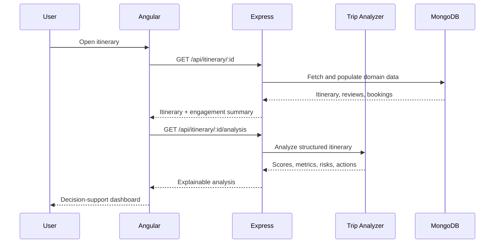

# Travel Intelligence Platform — Engineering Project Report

## 1. Abstract

Travel planning applications often store destinations and dates but do not evaluate whether a plan is complete, affordable, balanced, or environmentally reasonable. This project implements a MEAN-stack decision-support platform that combines itinerary management with explainable trip analysis, traveler engagement, AI-assisted discovery, and administrative analytics.

The system accepts structured trip data, derives operational metrics, calculates five planning scores, detects risks, and recommends corrective actions. It also supports role-based lifecycle management, booking workflows, wishlists, reviews, and aggregated demand analysis.

## 2. Problem statement

Manual itinerary planning creates several recurring problems:

- Trip days are left unplanned or overloaded.
- The total budget does not match category-level estimates.
- Group size is ignored when estimating daily cost.
- Travelers cannot compare itinerary quality objectively.
- Administrators cannot identify high-demand destinations from user behavior.
- AI suggestions may be useful but are non-deterministic and difficult to audit.

The proposed system separates these concerns: AI supports discovery, while a deterministic engine performs explainable planning analysis.

## 3. Objectives

1. Build a complete MEAN-stack application with modular frontend and backend architecture.
2. Secure the application with authentication and role-based authorization.
3. Model detailed itineraries, daily activities, bookings, wishlists, and reviews.
4. Develop an explainable multi-criteria trip assessment algorithm.
5. Provide administrative decision support using database aggregation.
6. Integrate third-party AI and image APIs safely with validation, caching, and rate limits.
7. Verify core behavior with automated unit, property-based, and API route tests.

## 4. Functional requirements

### Traveler

- Register and authenticate.
- Browse published itineraries.
- Create and manage owned itineraries.
- Inspect daily plans and Trip Intelligence results.
- Save or unsave an itinerary.
- Submit or cancel a booking.
- Submit and update one review per itinerary.
- View saved and booked trips.

### Administrator

- View active and inactive itineraries.
- Activate or deactivate travel products.
- Monitor total bookings, saves, reviews, and average budget.
- Rank destinations using engagement signals.
- Search and filter the portfolio.
- Update booking workflow status.

### Superadministrator

- Manage users and roles.
- Activate or deactivate user accounts.
- Review administrator access requests.

## 5. Non-functional requirements

- Security: hashed passwords, signed tokens, server-side authorization, protected Angular routes.
- Reliability: input checks, API error handling, cache TTLs, rate limiting.
- Explainability: every score is derived from visible inputs and paired with recommendations.
- Maintainability: domain routes, models, middleware, utilities, and UI services are separated.
- Scalability: MongoDB indexes support destination, owner, booking, and wishlist queries.
- Portability: environment-based configuration and same-origin production API support.
- Deployment: Render Blueprint, pinned Node LTS runtime, readiness checks, and graceful shutdown.

## 6. System design



## 7. Data model

### User

- Identity: name and unique email
- Security: bcrypt password hash
- Authorization: user, admin, or superadmin
- Lifecycle: active/inactive state

### Itinerary

- Core: title, destination, dates, duration, description
- Planning: travelers, category, style, transport, accommodation
- Finance: total budget and five-part budget breakdown
- Schedule: days and timestamped activities
- Summary: distance, travel time, meals, highlights
- Engagement: bookings, favorites, ratings, reviews
- Governance: creator and active state

### Role request

- Requester, requested role, reason, status
- Reviewer, review timestamp, and review notes

## 8. Trip Intelligence algorithm

The engine in `server/utils/tripAnalyzer.js` is intentionally deterministic.

### Derived metrics

- Inclusive trip duration
- Planned day coverage
- Total and average activities
- Budget per day
- Budget per traveler
- Budget per traveler per day
- Budget category total and variance
- Pace classification

### Scores

| Score | Main factors |
|---|---|
| Completeness | Description quality, day coverage, activity density, highlights, category budget |
| Pace | Activities per day and uncovered days |
| Budget | Daily affordability, category variance, contingency reserve |
| Sustainability | Transport and accommodation impact coefficients |
| Feasibility | Weighted combination of the other four scores |

```text
F = 0.35C + 0.25P + 0.25B + 0.15S
```

All scores are clamped to the range 0–100.

### Risk rules

- `UNPLANNED_DAYS`
- `OVERLOADED_SCHEDULE`
- `LOW_DAILY_BUDGET`
- `BUDGET_MISMATCH`
- `HIGH_IMPACT_SHORT_TRIP`

This rule-based layer is suitable for evaluation because identical inputs always produce identical results.

## 9. Analytics design

The administration module uses MongoDB aggregation pipelines instead of calculating portfolio statistics in Angular. The API computes:

- Total, active, and inactive itineraries
- Total bookings, favorites, and reviews
- Average itinerary budget
- Booking counts grouped by status
- Top destinations ranked by combined engagement

This reduces client workload and keeps business logic authoritative on the server.

## 10. Security design

- Passwords are salted and hashed with bcrypt.
- JWTs expire after seven days.
- Every protected API resolves the current active user from the database.
- Role middleware rejects unauthorized administration requests.
- Owners may edit their own itineraries; privileged roles may manage all.
- Editable itinerary fields are allow-listed to prevent mass assignment.
- Query parameters are sanitized and length-limited.
- AI routes are rate-limited and cached.
- CORS origins are controlled through configuration.
- Angular guards protect authenticated and administrator screens.

For a production deployment, tokens should be migrated from local storage to secure, HTTP-only cookies with CSRF protection.

## 11. Testing strategy

The backend test suite covers:

- Cache set/get behavior and expiration
- Rate-limit boundaries and IP isolation
- Query input validation
- AI response shape invariants
- API cache headers
- Trip duration calculations
- Balanced itinerary scoring
- Risk detection for overloaded and underfunded plans

Property-based tests use generated inputs to verify invariants rather than only fixed examples.

## 12. Results

At the current checkpoint:

- 31 backend tests pass.
- 34 frontend tests pass.
- The Angular application builds successfully.
- JavaScript syntax validation passes.
- Production dependency audits report zero known vulnerabilities.
- The project supports complete traveler and administrator demonstrations.

## 13. Limitations

- The in-memory cache and limiter are process-local; distributed deployment should use Redis.
- External AI quality depends on provider availability.
- Carbon impact uses relative coefficients, not a certified emissions database.
- Payment processing and booking inventory are outside the current scope.
- Real-time collaboration is not yet implemented.

## 14. Future scope

1. Redis-backed distributed caching and rate limiting.
2. Geospatial route optimization using map coordinates.
3. Certified transport carbon factors.
4. Payment gateway and inventory reservation.
5. Notification service for booking and role status changes.
6. WebSocket-based collaborative itinerary editing.
7. PDF itinerary export and offline progressive web app support.
8. Containerized deployment with CI/CD and observability dashboards.

## 15. Render deployment architecture

The repository uses infrastructure-as-code through `render.yaml`.

- Render installs root production dependencies.
- The build script performs a clean frontend dependency install and Angular production build.
- Express serves `frontend/dist/frontend/browser`.
- The service binds to `0.0.0.0` using Render's injected `PORT`.
- Production startup waits for MongoDB and fails early if the database is unavailable.
- `/api/health` reports service and database readiness.
- `SIGTERM` closes the HTTP server and MongoDB connection before the instance exits.
- Auto-deployment is triggered by commits pushed to the connected branch.

## 16. Viva discussion points

- Why deterministic analysis is used instead of asking an LLM to score a trip.
- How MongoDB embedding fits bookings and reviews, and when separate collections would be preferable.
- How owner authorization differs from role authorization.
- Why analytics are computed server-side.
- How property-based tests complement example-based tests.
- How the architecture would change for multiple API instances.
