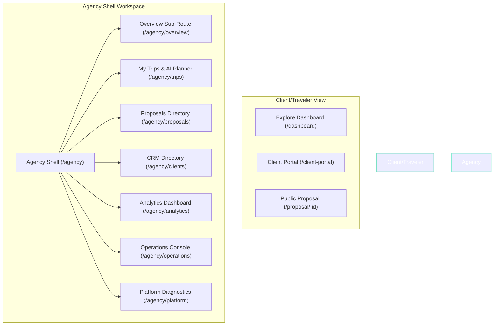

# TraVenture — Project Architecture & Branch Comparison Report

This report documents the architectural design, user navigation workflows, system component structure, and a comparative analysis between the current development branch (`yuvraj-dev`) and the target production branch (`main`).

---

## 1. System Architecture

Under the new **Agency-Centric Refactor**, the frontend application separates ordinary traveler experiences from staff workspace features. All administration, curation, and platform controls are consolidated under a single, unified, role-aware **Agency Workspace Shell** at `/agency`.

### Component Topology (Agency-Centric Shell)

```mermaid
graph TD
  subgraph Client/Traveler View
    DashboardComponent["Explore Dashboard (/dashboard)"]
    ClientDashboardComponent["Client Portal (/client-portal)"]
    PublicItineraryComponent["Public Proposal (/proposal/:id)"]
  end

  subgraph Agency Shell Workspace
    AgencyWorkspaceComponent["Agency Shell (/agency)"]
    AgencyOverviewComponent["Overview Sub-Route (/agency/overview)"]
    AgencyTripsComponent["My Trips & AI Planner (/agency/trips)"]
    AgencyProposalsComponent["Proposals Directory (/agency/proposals)"]
    AgencyClientsComponent["CRM Directory (/agency/clients)"]
    AgencyAnalyticsComponent["Analytics Dashboard (/agency/analytics)"]
    AgencyOperationsComponent["Operations Console (/agency/operations)"]
    AgencyPlatformComponent["Platform Diagnostics (/agency/platform)"]
  end

  %% Navigation connections
  AgencyWorkspaceComponent --> AgencyOverviewComponent
  AgencyWorkspaceComponent --> AgencyTripsComponent
  AgencyWorkspaceComponent --> AgencyProposalsComponent
  AgencyWorkspaceComponent --> AgencyClientsComponent
  AgencyWorkspaceComponent --> AgencyAnalyticsComponent
  AgencyWorkspaceComponent --> AgencyOperationsComponent
  AgencyWorkspaceComponent --> AgencyPlatformComponent

  style Client/Traveler View fill:#05201f,stroke:#7ae0c3,stroke-width:2px,color:#fff
  style Agency Shell Workspace fill:#091d29,stroke:#86ebd2,stroke-width:2px,color:#fff
```

---

## 2. User Authentication & Authorization Flow

The application dynamically controls access to routes, navbar links, and button triggers depending on the user's authenticated credentials and role attributes (`user`, `trip-manager`, `admin`, `superadmin`).

```mermaid
flowchart TD
  Start([User Enters Application]) --> AuthCheck{Is Logged In?}
  
  %% Guest Flow
  AuthCheck -- No --> GuestView[Guest Experience]
  GuestView --> GuestLinks["Browse Home, Explore Public Routes, View Public Proposals (/proposal/:id)"]
  
  %% Logged In Flow
  AuthCheck -- Yes --> RoleResolve{Check User Role}
  
  %% Traveler Flow
  RoleResolve -- 'user' (Traveler) --> TravelerLinks["Access Explore Dashboard (/dashboard)<br/>- Browse live routes<br/>- Save wishlist favorites<br/>- View bookings<br/>- Review /client-portal"]
  
  %% Trip Manager Flow
  RoleResolve -- 'trip-manager' --> StaffBase["Access Explore Dashboard<br/>+ Agency Workspace (/agency)<br/>- Overview metrics<br/>- Trips board & AI Modal Planner<br/>- Proposals directory<br/>- Currency analytics"]
  
  %% Admin Flow
  RoleResolve -- 'admin' --> AdminBase["Access Staff Workspace + Admin Features<br/>- Clients directory (CRM)<br/>- Operations console (/agency/operations)<br/>  * Moderate global itineraries<br/>  * Review upgrade requests<br/>  * Track affiliate click payouts"]
  
  %% Superadmin Flow
  RoleResolve -- 'superadmin' --> SuperBase["Access All Workspace Features<br/>- Platform diagnostics console (/agency/platform)<br/>  * Global accounts role promotion/toggles<br/>  * AI provider fallback telemetry<br/>  * System database diagnostics"]
  
  %% Redirections
  TravelerLinks -.->|Block /agency access| GuestView
  StaffBase -.->|Block Operations/Platform| StaffBase
  AdminBase -.->|Block Platform| AdminBase
```

---

## 3. Branch Comparison Analysis

A comparative review reveals architectural differences, fallback systems, and features active between the two main repository branches.

| Category / Component | Development Branch (`yuvraj-dev`) | Production Branch (`main`) | Architectural Rationale |
| :--- | :--- | :--- | :--- |
| **Workspace Shell** | **Unified Shell (`/agency`)**: Consolidates `/workspace`, `/operations`, and `/platform` into child tabs within a single sidebar controller. | **Segmented Dashboards**: Separate top-level routes (`/workspace`, `/operations`, `/platform`) managed by individual layout components. | The `/agency` shell reduces page fragmentation, streamlines authentication guards, and provides a cohesive experience for staff. |
| **AI Integration** | **Multi-Provider Failover**: Dynamically falls back and quarantines unhealthy models across NVIDIA NIM, Ollama, and Gemini APIs. | **Single AI Provider**: Consolidated into `aiProvider.js` leveraging a single model endpoint without fallback telemetry. | Fallback telemetry guarantees maximum availability and resilience in offline development environments. |
| **Billing & Costs** | **Standard Billing stub**: Basic affiliate clicking tracker model. | **Billing & Cost Estimation**: Active `costEstimationService.js` and `billingService.js` tracking organization quotas. | Supports multi-tenant enterprise pricing tiers and quota tracking in production. |
| **Mapping Engine** | **Leaflet Integration**: Lightweight map canvas wrapper component. | **Mapbox Integration**: Maps rendering using `mapboxAdapter.js` and its corresponding unit tests. | Mapbox provides superior geospatial optimizations, route path geometries, and custom styling options. |
| **Data Models** | `User`, `Itinerary`, `RoleRequest`. | `User`, `Itinerary`, `RoleRequest`, `AffiliateClick`, `Organization` (Multi-tenant structure). | Prepares database architectures for tenant isolation and detailed click telemetry. |
| **Documentation** | Preserves detailed API documents (`docs/RAG.md`, `ARCHITECTURE.md`). | Cleaned up detailed documentation folders in favor of a consolidated `plan.md`. | Simplifies codebase updates and aggregates plans in a single location. |

---

## 4. Platform Data Model Specification

The database utilizes MongoDB to model entities, transactions, and curation state:

### User Account
* `name` (String): Display name.
* `email` (String, Unique): Authentication address.
* `password` (String, Hashed): Bcrypt security hash.
* `role` (Enum): `user` (Traveler), `trip-manager` (Staff Curator), `admin` (Operations Moderator), `superadmin` (System Administrator).
* `isActive` (Boolean): Operational status toggle.

### Itinerary Itinerary
* `title` (String): Trip heading.
* `destination` (String): Destination name.
* `startDate` & `endDate` (ISODate): Travel dates.
* `duration` (String): Calculated length.
* `budget` (Number) & `budgetBreakdown` (Object): Transport, Accommodation, Food, Activities, Contingency values.
* `stops` (Array): Array of named checkpoints and description notes.
* `status` (Enum): `draft` (Private workspace), `published` (Visible to travelers).
* `isActive` (Boolean): Admin visibility status toggle.
* `engagement` (Object): Saves count, review counters, average rating score.

### Role Request
* `userId` (ObjectID): Reference to requester.
* `requestedRole` (String): Target role.
* `reason` (String): Upgrade reasoning.
* `status` (Enum): `pending`, `approved`, `rejected`.
* `reviewerId` (ObjectID) & `reviewNotes` (String): Verification records.

---

## 5. Trip Intelligence Core Algorithm

The analysis engine in [tripAnalyzer.js](file:///d:/1YUVRAJ/program/project/mean_mini/server/utils/tripAnalyzer.js) computes scores and warns of planning problems:

### Metric Deductions
* **Daily Budget**: Total budget divided by days.
* **Activity Load**: Total planned activities divided by days.
* **Pace Level**: Classified as `relaxed`, `moderate`, or `intense` depending on activity frequency.

### Score Formulas (0-100 range)
* **Completeness**: Evaluated based on description length, day theme coverage, and highlights details.
* **Pace**: Measures schedule overloading. Rejects plans with too many activities per day.
* **Budget**: Compares daily budget against target category estimates and checks contingency reserves (ideally > 10%).
* **Sustainability**: Coeffecients based on transportation and hotel choices.
* **Overall Feasibility (F)**:
  $$F = 0.35 \times \text{Completeness} + 0.25 \times \text{Pace} + 0.25 \times \text{Budget} + 0.15 \times \text{Sustainability}$$

### Risk Flag Rules
* `UNPLANNED_DAYS`: Detected when calendar duration exceeds daily plan array length.
* `OVERLOADED_SCHEDULE`: Triggered when pace matches intensive activity frequencies.
* `LOW_DAILY_BUDGET`: Triggered when average daily budget drops below threshold.
* `BUDGET_MISMATCH`: Triggered when budget breakdown does not sum to total budget.
