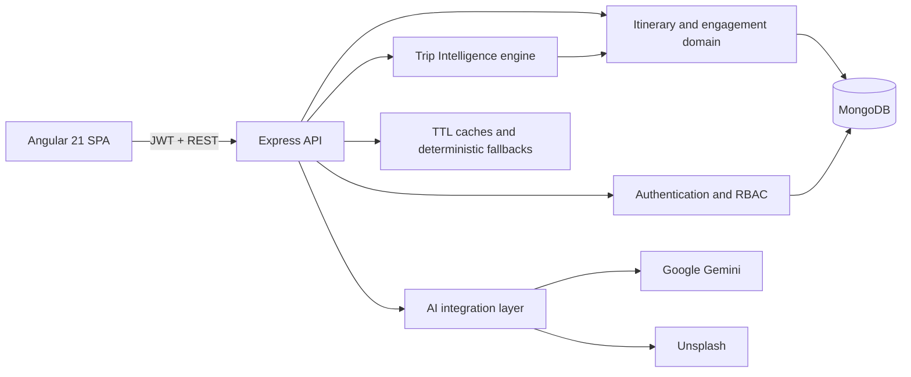

# Travel Intelligence & Itinerary Management Platform

A full-stack MEAN application for discovering, designing, evaluating, publishing, saving, booking, and reviewing travel itineraries. It combines Angular Material glassmorphism, role-based workflows, AI-assisted discovery, deterministic trip analysis, community engagement, and live MongoDB analytics.

## Highlights

- Four-step itinerary wizard with automatic duration, budget allocation, and multi-stop planning.
- Dashboard, detail, saved, and booking views backed by live MongoDB data.
- Shared deterministic destination imagery so dashboard cards and detail heroes always match.
- Destination autocomplete, trending places, attraction suggestions, and destination previews.
- Graceful local fallbacks when Gemini, Unsplash, DNS, or an external MongoDB deployment is unavailable.
- Trip Intelligence scores for feasibility, completeness, pace, budget quality, and sustainability.
- Risk register and explainable recommendations derived from itinerary data.
- Wishlist, booking, cancellation, ratings, reviews, and administrator analytics.
- JWT authentication, automatic expired-session cleanup, role authorization, rate limiting, and input validation.
- Responsive Angular Material interface with glass surfaces, ambient shapes, and local optimized travel images.

## Architecture



## Technology

- MongoDB and Mongoose
- Express.js and Node.js 24
- Angular 21, Angular Material, TypeScript, RxJS, Tailwind CSS
- JWT and bcryptjs
- Google Gemini and Unsplash APIs
- Node test runner, fast-check, Vitest, Playwright, and Puppeteer

## Local setup

Requirements: Node.js 24 and either MongoDB or permission to use the development in-memory fallback.

```bash
npm install
cd frontend
npm install
cd ..
copy .env.example .env
```

Configure `.env`:

```env
MONGO_URI=mongodb://127.0.0.1:27017/travel_intelligence
JWT_SECRET=replace-with-a-long-secret
PORT=5000
GEMINI_API_KEY=
UNSPLASH_ACCESS_KEY=
```

Seed and run:

```bash
npm run seed:demo
npm run dev:full
```

- Angular development server: `http://localhost:4200`
- Express API: `http://localhost:5000`
- Health endpoint: `http://localhost:5000/api/health`

## Commands

```bash
npm run dev
npm run frontend
npm run dev:full
npm run test
npm run test:frontend
npm run test:all
npm run test:ui
npm run frontend:build
npm run init-db
npm run seed:demo
```

## Roles

- User: browse, search, save, book, cancel, and review published itineraries.
- Admin: publish and manage itineraries and booking workflows.
- Superadmin: administrator capabilities plus user and role governance.

## API overview

### Authentication

- `POST /api/auth/register`
- `POST /api/auth/login`
- `GET /api/auth/profile`

### Itineraries and intelligence

- `GET /api/itinerary`
- `POST /api/itinerary`
- `GET /api/itinerary/:id`
- `PUT /api/itinerary/:id`
- `DELETE /api/itinerary/:id`
- `GET /api/itinerary/:id/analysis`

### Engagement

- `POST /api/itinerary/:id/favorite`
- `GET /api/itinerary/user/favorites`
- `POST /api/itinerary/:id/book`
- `DELETE /api/itinerary/:id/book`
- `GET /api/itinerary/user/bookings`
- `POST /api/itinerary/:id/reviews`

### Administration

- `GET /api/itinerary/analytics/overview`
- `PATCH /api/itinerary/:id/bookings/:bookingId/status`
- `GET /api/users`
- `PUT /api/users/:id/role`
- `PUT /api/users/:id/status`
- `GET /api/role-requests`
- `PUT /api/role-requests/:id/review`

### AI assistance

- `GET /api/image?place=...`
- `GET /api/suggestions?q=...`
- `GET /api/trending`
- `GET /api/itinerary-suggestions?place=...`

## Deployment

The repository includes Docker, Jenkins, and Render configuration. For Render, use:

```text
Runtime: Node
Build Command: npm ci --omit=dev && npm run build
Start Command: npm start
Health Check Path: /api/health
Node Version: 24.17.0
```

See [docs/PROJECT_REPORT.md](docs/PROJECT_REPORT.md) for the data model, scoring method, security design, testing strategy, limitations, and viva-oriented notes.

## Authors

Contact: sharn.ss123@gmail.com, yuvsingh716@gmail.com

License: ISC
