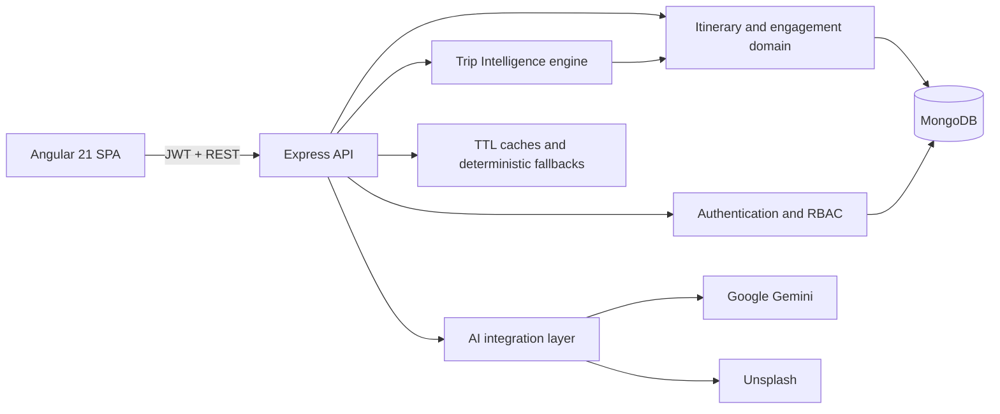

# Travel Intelligence & Itinerary Management Platform

A full-stack MEAN application for discovering, designing, evaluating, publishing, saving, booking, and reviewing travel itineraries. It combines Angular Material glassmorphism, role-based workflows, AI-assisted discovery, deterministic trip analysis, community engagement, and live MongoDB analytics.

## Highlights

- Four-step itinerary wizard with automatic duration, budget allocation, and multi-stop planning.
- Dashboard, detail, saved, and booking views backed by live MongoDB data.
- Shared deterministic destination imagery so dashboard cards and detail heroes always match.
- Destination autocomplete, trending places, attraction suggestions, and destination previews.
- Graceful local fallbacks when Gemini, Unsplash, DNS, or an external MongoDB deployment is unavailable.
- Trip Intelligence scores for feasibility, completeness, pace, budget quality, and sustainability.
- Risk register and explainable recommendations derived from itinerary data.
- Wishlist, booking, cancellation, ratings, reviews, and administrator analytics.
- JWT authentication, automatic expired-session cleanup, role authorization, rate limiting, and input validation.
- Responsive Angular Material interface with glass surfaces, ambient shapes, and local optimized travel images.

## Architecture



## Technology

- MongoDB and Mongoose
- Express.js and Node.js 24
- Angular 21, Angular Material, TypeScript, RxJS, Tailwind CSS
- JWT and bcryptjs
- Google Gemini and Unsplash APIs
- Node test runner, fast-check, Vitest, Playwright, and Puppeteer

## Prerequisites

- Node.js `24.17.0`
- npm `11.x`
- MongoDB Atlas or a local MongoDB instance if you do not want to rely on the development fallback
- Docker Desktop or Docker Engine if you want to validate the container workflow

Version files included in the repo:

- `.node-version`
- `.nvmrc`

On Windows PowerShell, if `npm` is blocked by execution policy, use `npm.cmd` instead.

## Development workflow

- `main` is the stable branch.
- Use `yuvraj-dev` for active development work.
- Do not commit Phase 0 or feature work directly on `main`.

## Local setup

Install root and frontend dependencies from a clean environment:

```bash
npm ci
cd frontend
npm ci
cd ..
copy .env.example .env
```

If you already have stale `node_modules` content, remove it first and rerun the clean install steps above.

## Environment setup

Copy `.env.example` to `.env` and fill in the values you need:

```env
NODE_ENV=development
PORT=5000
MONGO_URI=
JWT_SECRET=replace_with_a_long_random_secret
CLIENT_ORIGINS=http://localhost:4200
UNSPLASH_ACCESS_KEY=
GEMINI_API_KEY=
MAPBOX_TOKEN=
```

Notes:

- Leave `MONGO_URI` blank only if you intentionally want to test the development fallback path.
- `MAPBOX_TOKEN` is included as a forward-looking placeholder for the map-driven roadmap work.
- `RENDER_EXTERNAL_URL` is supplied by Render in production and does not need to be set locally.

## Run the app

Seed demo data when you have a working database connection:

```bash
npm run seed:demo
```

Run backend and frontend together:

```bash
npm run dev:full
```

Useful local URLs:

- Angular development server: `http://localhost:4200`
- Express API: `http://localhost:5000`
- Health endpoint: `http://localhost:5000/api/health`

## Commands

```bash
npm run dev
npm run frontend
npm run dev:full
npm run test
npm run test:frontend
npm run test:all
npm run test:ui
npm run frontend:build
npm run init-db
npm run seed:demo
```

## Testing

Backend test suite:

```bash
npm run test:backend
```

Frontend unit tests:

```bash
npm run test:frontend
```

Full test run:

```bash
npm run test:all
```

UI audit script:

```bash
npm run test:ui
```

## Build

Frontend-only build:

```bash
npm run frontend:build
```

Root production-style build:

```bash
npm run build
```

The root build script installs frontend dependencies and then runs the Angular production build from the correct working directory.

## Docker

The repo includes a frontend container build in `frontend/Dockerfile`.

Build it with:

```bash
docker build -t mean-mini-frontend ./frontend
```

Requirements:

- Docker daemon must be running
- Local Docker config must be accessible
- Node 24 is used inside the Docker build stage

## Backend startup notes

- The backend uses `MONGO_URI` when provided.
- In development, it attempts to fall back to an in-memory MongoDB only when the required dev dependency set is installed.
- In production, startup aborts if MongoDB is unavailable.

## Roles

- User: browse, search, save, book, cancel, and review published itineraries.
- Admin: publish and manage itineraries and booking workflows.
- Superadmin: administrator capabilities plus user and role governance.

## API overview

### Authentication

- `POST /api/auth/register`
- `POST /api/auth/login`
- `GET /api/auth/profile`

### Itineraries and intelligence

- `GET /api/itinerary`
- `POST /api/itinerary`
- `GET /api/itinerary/:id`
- `PUT /api/itinerary/:id`
- `DELETE /api/itinerary/:id`
- `GET /api/itinerary/:id/analysis`

### Engagement

- `POST /api/itinerary/:id/favorite`
- `GET /api/itinerary/user/favorites`
- `POST /api/itinerary/:id/book`
- `DELETE /api/itinerary/:id/book`
- `GET /api/itinerary/user/bookings`
- `POST /api/itinerary/:id/reviews`

### Administration

- `GET /api/itinerary/analytics/overview`
- `PATCH /api/itinerary/:id/bookings/:bookingId/status`
- `GET /api/users`
- `PUT /api/users/:id/role`
- `PUT /api/users/:id/status`
- `GET /api/role-requests`
- `PUT /api/role-requests/:id/review`

### AI assistance

- `GET /api/image?place=...`
- `GET /api/suggestions?q=...`
- `GET /api/trending`
- `GET /api/itinerary-suggestions?place=...`

## Deployment

The repository includes Docker, Jenkins, and Render configuration. For Render, use:

```text
Runtime: Node
Build Command: npm ci --omit=dev && npm run build
Start Command: npm start
Health Check Path: /api/health
Node Version: 24.17.0
```

See [docs/PROJECT_REPORT.md](docs/PROJECT_REPORT.md) for the data model, scoring method, security design, testing strategy, limitations, and viva-oriented notes.

## Authors

Contact: sharn.ss123@gmail.com, yuvsingh716@gmail.com

License: ISC
