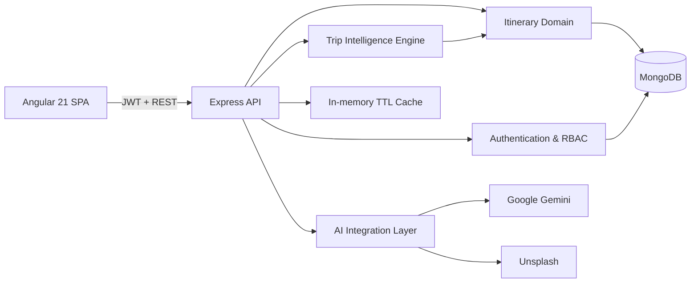

# Travel Intelligence & Itinerary Management Platform

A full-stack MEAN application for designing, evaluating, publishing, booking, and monitoring travel itineraries. The project combines role-based workflows, AI-assisted destination discovery, deterministic trip feasibility analysis, community feedback, and portfolio analytics.

## Why this is a major engineering project

The system is more than CRUD:

- A multi-criteria **Trip Intelligence engine** scores feasibility, completeness, pace, budget quality, and sustainability.
- A **risk register** detects unplanned days, unrealistic budgets, overloaded schedules, budget mismatches, and high-impact short trips.
- Travelers can maintain a **wishlist**, submit booking requests, cancel bookings, and create or update reviews.
- Administrators receive live **MongoDB aggregation analytics** for bookings, saves, reviews, active plans, and destination demand.
- Authentication uses JWT, bcrypt password hashing, role authorization, route guards, input validation, API rate limiting, and CORS controls.
- Gemini and Unsplash integrations include normalization, caching, failure handling, and rate limiting.
- The backend includes unit, route, and property-based tests.

## Architecture



### Trip Intelligence model

The final feasibility score is deterministic and explainable:

```text
Feasibility =
  35% Completeness +
  25% Pace +
  25% Budget Quality +
  15% Sustainability
```

Inputs include date coverage, activities per day, travelers, total and category budgets, contingency, transport mode, accommodation type, highlights, and schedule detail. The engine returns scores, derived metrics, risks, and recommended actions.

## Main modules

| Module | Capabilities |
|---|---|
| Authentication | Registration, login, JWT sessions, bcrypt hashing, protected routes |
| Roles | User, admin, and superadmin authorization |
| Itineraries | Create, browse, update, activate/deactivate, delete, detailed daily plans |
| Trip Intelligence | Five scores, budget metrics, pace classification, risk detection |
| Engagement | Wishlist, bookings, cancellation, ratings, reviews |
| Administration | Live KPIs, demand ranking, search, filtering, lifecycle controls |
| AI assistant | Place search, trending destinations, attraction suggestions, destination images |
| Reliability | TTL cache, rate limiter, validation, graceful API failures, automated tests |

## Technology stack

- MongoDB and Mongoose
- Express.js and Node.js
- Angular 21, TypeScript, RxJS, and Tailwind CSS
- JWT and bcryptjs
- Google Gemini and Unsplash APIs
- Node test runner, fast-check, Vitest, and Angular build tooling

## Local setup

Requirements: Node.js 24 LTS and MongoDB.

```bash
npm install
cd frontend
npm install
cd ..
cp .env.example .env
```

Configure `.env`, then initialize the sample data:

```bash
npm run init-db
npm run dev:full
```

- Angular: `http://localhost:4200`
- API: `http://localhost:5000`
- Health check: `http://localhost:5000/api/health`

The seed script creates demonstration accounts. Change their passwords before using the project outside a local demonstration.

## Render deployment

The repository includes a Render Blueprint at [`render.yaml`](render.yaml) and pins Node.js through [`.node-version`](.node-version).

### Blueprint deployment

1. In Render, choose **New → Blueprint**.
2. Connect this GitHub repository.
3. Render reads `render.yaml` and creates the web service.
4. Enter `MONGO_URI`, `GEMINI_API_KEY`, and `UNSPLASH_ACCESS_KEY` when prompted.
5. `JWT_SECRET` is generated securely by Render.

### Existing Render service

Use these settings:

```text
Runtime: Node
Build Command: npm ci --omit=dev && npm run build
Start Command: npm start
Health Check Path: /api/health
Node Version: 24.17.0
```

Required environment variables:

```text
NODE_ENV=production
MONGO_URI=<MongoDB Atlas connection string>
JWT_SECRET=<long random secret>
GEMINI_API_KEY=<optional AI features>
UNSPLASH_ACCESS_KEY=<optional destination images>
```

The Express server binds to Render's dynamic `PORT` on `0.0.0.0`, waits for MongoDB before accepting traffic, serves the optimized Angular build, reports readiness at `/api/health`, and handles Render's `SIGTERM` shutdown signal gracefully.

## Commands

```bash
npm run dev              # Express API
npm run frontend         # Angular development server
npm run dev:full         # API and Angular together
npm run test             # Backend unit, property, and route tests
npm run test:frontend    # Angular/Vitest tests
npm run test:all         # Complete backend and frontend verification
npm run frontend:build   # Angular production build
npm run init-db          # Seed users and a detailed itinerary
```

## API overview

### Authentication

- `POST /api/auth/register`
- `POST /api/auth/login`
- `GET /api/auth/profile`

### Itineraries and intelligence

- `GET /api/itinerary`
- `POST /api/itinerary`
- `GET /api/itinerary/:id`
- `PUT /api/itinerary/:id`
- `DELETE /api/itinerary/:id`
- `GET /api/itinerary/:id/analysis`

### Traveler engagement

- `POST /api/itinerary/:id/favorite`
- `GET /api/itinerary/user/favorites`
- `POST /api/itinerary/:id/book`
- `DELETE /api/itinerary/:id/book`
- `GET /api/itinerary/user/bookings`
- `POST /api/itinerary/:id/reviews`

### Administration

- `GET /api/itinerary/analytics/overview`
- `PATCH /api/itinerary/:id/bookings/:bookingId/status`
- `GET /api/users`
- `PUT /api/users/:id/role`
- `PUT /api/users/:id/status`
- `GET /api/role-requests`
- `PUT /api/role-requests/:id/review`

### AI assistance

- `GET /api/image?place=...`
- `GET /api/suggestions?q=...`
- `GET /api/trending`
- `GET /api/itinerary-suggestions?place=...`

## Project structure

```text
server/
  config/          MongoDB connection
  data/            Seed itinerary
  middleware/      Authentication, validation, rate limiting
  models/          Mongoose domain models
  routes/          REST API modules
  tests/           Unit, property, and route tests
  utils/           Cache and Trip Intelligence engine
frontend/src/app/
  components/      Standalone Angular screens and UI modules
  guards/          Authentication and admin route protection
  services/        Typed API, AI, and authentication clients
docs/
  PROJECT_REPORT.md
```

## Engineering report

See [docs/PROJECT_REPORT.md](docs/PROJECT_REPORT.md) for the problem statement, objectives, data model, scoring method, security design, test strategy, limitations, future scope, and viva-oriented technical notes.

## Verification status

- Backend: 31 tests passing
- Frontend: 34 tests passing
- Frontend: Angular production build passing
- Static JavaScript syntax checks passing
- Production dependency audits: 0 known vulnerabilities

The optimized production bundle is approximately 477 kB before transfer compression.

## Authors

Contact: sharn.ss123@gmail.com, yuvsingh716@gmail.com

License: ISC
