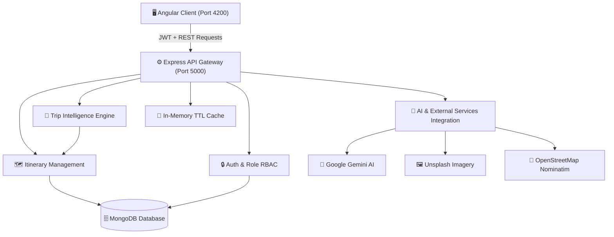

# 🌍 Travel Intelligence & Itinerary Management Platform

[](https://nodejs.org/)
[](https://angular.dev/)
[](https://www.docker.com/)
[](LICENSE)

A high-performance, full-stack MEAN application for discovering, planning, analyzing, publishing, booking, and reviewing travel itineraries. It features a responsive Angular Material glassmorphism layout, role-based workflows, dynamic AI-assisted suggestions, and deterministic feasibility analysis.

---

## ✨ Features at a Glance

*   **⚡ Four-Step Itinerary Wizard**: Dynamic planning with automatic duration tracking, budget allocation, and multi-stop management.
*   **🤖 AI-Powered Budget & Tips**: Dynamic Gemini AI cost breakdown (`transport`, `accommodation`, `food`, `activities`, `miscellaneous`) and destination-specific tips with fallback systems.
*   **📍 Accurate Geocoding Fallback**: OpenStreetMap Nominatim integration resolves precise global coordinates (e.g., Dubai, Bhutan, AlUla) without requiring any API keys.
*   **📊 Trip Intelligence Scores**: Real-time feasibility assessment including completeness, pace, budget accuracy, and sustainability metrics.
*   **🛡️ Multi-Role Governance**: Tailored access control workflows for standard users, administrators, and super-administrators.
*   **🐳 Production-Ready Docker & Jenkins**: Fully integrated multi-container setup via `docker-compose` and clean frontend pipelines.

---

## 🏗️ Architecture


```mermaid
flowchart TD
    U["🖥️ Angular Client (Port 4200)"] -->|JWT + REST Requests| E["⚙️ Express API Gateway (Port 5000)"]
    E --> A["🔒 Auth & Role RBAC"]
    E --> I["🗺️ Itinerary Management"]
    E --> T["🧠 Trip Intelligence Engine"]
    E --> X["🤖 AI & External Services Integration"]
    
    I --> M[("🗄️ MongoDB Database")]
    A --> M
    T --> I
    
    X --> G["🧠 Google Gemini AI"]
    X --> P["🖼️ Unsplash Imagery"]
    X --> O["📍 OpenStreetMap Nominatim"]
    E --> C["💾 In-Memory TTL Cache"]
```

---

## 🛠️ Technology Stack

| Component | Technology | Description |
| :--- | :--- | :--- |
| **Frontend** | Angular 21, TypeScript, RxJS, Angular Material, Tailwind CSS | High-performance SPA with modern glassmorphism styling |
| **Backend** | Node.js 24, Express.js | Stateless REST API service |
| **Database** | MongoDB, Mongoose ORM | Document storage for users, itineraries, and bookings |
| **AI/GIS** | Google Gemini, Unsplash, OpenStreetMap Nominatim | Smart suggestions, image matching, and geocoding |
| **Testing** | Vitest, Puppeteer, Node Test Runner, fast-check | Unit, property-based, and UI validation suites |

---

## 🚀 Setup & Execution

### Prerequisites
- Node.js `>=24.17.0`
- npm `11.x`
- MongoDB (Atlas instance or local process)

### 1. Installation
Install workspace dependencies from the root directory:
```bash
npm run install:all
```
*(Or manually install in root and `./frontend` with `npm ci`)*

### 2. Configuration
Create a `.env` file in the root directory:
```env
NODE_ENV=development
PORT=5000
MONGO_URI=your_mongodb_connection_string
JWT_SECRET=your_jwt_signing_secret
CLIENT_ORIGINS=http://localhost:4200
UNSPLASH_ACCESS_KEY=your_unsplash_api_key
GEMINI_API_KEY=your_gemini_api_key
MAPBOX_TOKEN=mock_token
```

### 3. Running Locally
Seed the database with sample travel data:
```bash
npm run seed:demo
```
Start both the Angular dev server and backend Express application concurrently:
```bash
npm run dev:full
```
- **Web App**: `http://localhost:4200`
- **Express Backend**: `http://localhost:5000`
- **Health Check**: `http://localhost:5000/api/health`

---

## 🐳 Docker Deployment

The project is fully containerized. To spin up the database, backend, and frontend together:

```bash
docker-compose up --build -d
```

### Port Mappings
- **Frontend SPA**: `http://localhost:80`
- **API Services**: `http://localhost:5000`
- **MongoDB**: `localhost:27017`

---

## 🧑‍💻 Scripts & Commands

| Command | Action |
| :--- | :--- |
| `npm run dev` | Start backend Express API server |
| `npm run frontend` | Start Angular frontend client |
| `npm run dev:full` | Run backend and frontend concurrently |
| `npm run test` | Run backend test suites |
| `npm run test:frontend` | Run frontend unit tests |
| `npm run test:all` | Run all test cases in the workspace |
| `npm run init-db` | Reset and initialize clean database schema |
| `npm run seed:demo` | Seed mock itineraries, bookings, and reviews |

---

## 🔒 Roles & Access Control

*   **👤 Standard User**: Can explore published itineraries, save to favorites, manage bookings, write reviews, and submit Manager requests.
*   **🛡️ Admin (Trip Manager)**: Full capability to draft, publish, and manage itineraries and review user booking flows.
*   **👑 Superadmin**: Complete capability including role modifications, status adjustments, and platform analytics.

---

## 📬 Authors & License

- **Authors**: sharn.ss123@gmail.com, yuvsingh716@gmail.com
- **License**: [ISC License](LICENSE)
