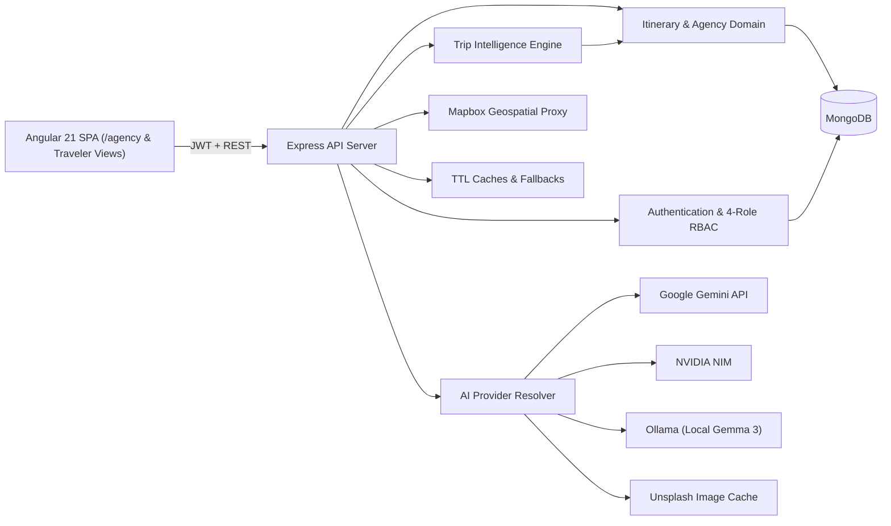
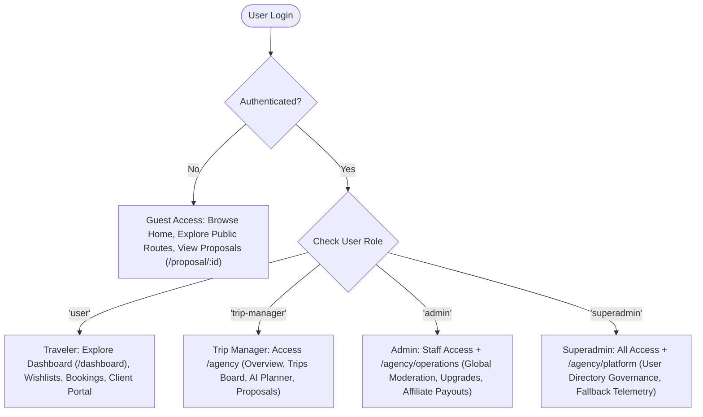

# TraVenture / Travel Intelligence Platform — Comprehensive Master Documentation

Welcome to the unified master technical documentation for the **TraVenture / Travel Intelligence Platform**. This document consolidates system architecture, product roadmap, AI subsystem design, RAG pipelines, API reference specifications, affiliate monetization, security architecture, deployment pipelines, contributing guidelines, and engineering development history into a single authoritative reference reflecting the current state of the codebase.

---

## Table of Contents

1. [Executive Overview & Technology Stack](#1-executive-overview--technology-stack)
2. [System Architecture & Data Models](#2-system-architecture--data-models)
   - [2.1 Frontend Topology (Agency-Centric Shell)](#21-frontend-topology-agency-centric-shell)
   - [2.2 Four-Role RBAC Model](#22-four-role-rbac-model)
   - [2.3 Database Schemas & Data Models](#23-database-schemas--data-models)
   - [2.4 Trip Intelligence Scoring Engine](#24-trip-intelligence-scoring-engine)
3. [AI Engineering & Multi-Provider Resolver](#3-ai-engineering--multi-provider-resolver)
   - [3.1 Multi-Provider Resolver Architecture](#31-multi-provider-resolver-architecture)
   - [3.2 Provider Abstraction & Interface Contract](#32-provider-abstraction--interface-contract)
   - [3.3 Prompt Engineering & Output Specifications](#33-prompt-engineering--output-specifications)
   - [3.4 Precision Editing & Deterministic Scope Merging](#34-precision-editing--deterministic-scope-merging)
   - [3.5 Enterprise AI Subsystem Modularization (`server/ai/`)](#35-enterprise-ai-subsystem-modularization-serverai)
4. [Retrieval-Augmented Generation (RAG) & Reviews Pipeline](#4-retrieval-augmented-generation-rag--reviews-pipeline)
   - [4.1 Grounding Itineraries with Authenticated Context](#41-grounding-itineraries-with-authenticated-context)
   - [4.2 Review Ingestion & Moderation Pipeline](#42-review-ingestion--moderation-pipeline)
   - [4.3 Vector Retrieval & Context Injection](#43-vector-retrieval--context-injection)
5. [API Reference Specification](#5-api-reference-specification)
   - [5.1 Authentication Endpoints](#51-authentication-endpoints)
   - [5.2 Itineraries & Intelligence Endpoints](#52-itineraries--intelligence-endpoints)
   - [5.3 Engagement Endpoints](#53-engagement-endpoints)
   - [5.4 Platform Operations & Role Management](#54-platform-operations--role-management)
   - [5.5 AI & Geospatial Endpoints](#55-ai--geospatial-endpoints)
6. [Affiliate & Monetization Layer](#6-affiliate--monetization-layer)
   - [6.1 Monetization Strategy](#61-monetization-strategy)
   - [6.2 In-Context Affiliate Link Injection](#62-in-context-affiliate-link-injection)
   - [6.3 Conversion & Revenue Analytics Tracking](#63-conversion--revenue-analytics-tracking)
7. [Security Architecture & Roadmap](#7-security-architecture--roadmap)
   - [7.1 Implemented Security Controls](#71-implemented-security-controls)
   - [7.2 Near-Term Security Roadmap](#72-near-term-security-roadmap)
8. [Product Roadmap & Execution Status](#8-product-roadmap--execution-status)
   - [8.1 Feature Matrix & Execution Status](#81-feature-matrix--execution-status)
   - [8.2 Long-Term Product Vision](#82-long-term-product-vision)
9. [Deployment Infrastructure & CI/CD Pipelines](#9-deployment-infrastructure--cicd-pipelines)
   - [9.1 Multi-Container Docker Setup](#91-multi-container-docker-setup)
   - [9.2 Jenkins CI/CD Pipeline](#92-jenkins-cicd-pipeline)
   - [9.3 Render Cloud Deployment (`render.yaml`)](#93-render-cloud-deployment-renderyaml)
10. [Contributing Guidelines & Engineering History](#10-contributing-guidelines--engineering-history)
    - [10.1 Branch Strategy & Development Environment](#101-branch-strategy--development-environment)
    - [10.2 Developer CLI Commands](#102-developer-cli-commands)
    - [10.3 Historical Engineering Challenges & Resolutions](#103-historical-engineering-challenges--resolutions)

---

## 1. Executive Overview & Technology Stack

**TraVenture (Travel Intelligence Platform)** is a SaaS platform designed for discovering, designing, evaluating, publishing, booking, and reviewing travel itineraries. It combines a natural-language AI discovery engine with an explainable, deterministic trip analysis engine and a multi-role agency workspace.

### Core Technology Stack
* **Frontend**: Angular 21 SPA featuring standalone components, RxJS reactive streams, Tailwind CSS, custom HSL color palettes, Angular Material, and Leaflet map canvases.
* **Backend**: Node.js (`>=24.0.0 <25.0.0`) & Express REST API server.
* **Database**: MongoDB with Mongoose object modeling.
* **AI Subsystem**: Provider-agnostic resolver cascading across Google Gemini (Cloud), NVIDIA NIM, and Ollama (Local Gemma 3).
* **Geospatial Services**: Backend Mapbox API proxy services (`/geocode` and `/directions`) rendering on client-side Leaflet maps.
* **Media Enrichment**: Unsplash API image lookup service (`/api/image`) with local fallback and local-first caching.



---

## 2. System Architecture & Data Models

### 2.1 Frontend Topology (Agency-Centric Shell)

The frontend application separates public traveler interactions from staff workspace operations. All management, curation, administrative, and diagnostic capabilities are unified under the **Agency Workspace Shell** at `/agency`.

```mermaid
graph TD
  subgraph Traveler Experience
    DashboardComponent["Explore Dashboard (/dashboard)"]
    ClientDashboardComponent["Client Portal (/client-portal)"]
    PublicItineraryComponent["Public Proposal (/proposal/:id)"]
  end

  subgraph Agency Shell Workspace (/agency)
    AgencyWorkspaceComponent["Agency Shell Parent"]
    AgencyOverviewComponent["Overview (/agency/overview)"]
    AgencyTripsComponent["Trips Board & AI Planner (/agency/trips)"]
    AgencyProposalsComponent["Proposals Directory (/agency/proposals)"]
    AgencyClientsComponent["CRM Directory (/agency/clients)"]
    AgencyAnalyticsComponent["Analytics Dashboard (/agency/analytics)"]
    AgencyOperationsComponent["Operations Console (/agency/operations)"]
    AgencyPlatformComponent["Platform Diagnostics (/agency/platform)"]
  end

  AgencyWorkspaceComponent --> AgencyOverviewComponent
  AgencyWorkspaceComponent --> AgencyTripsComponent
  AgencyWorkspaceComponent --> AgencyProposalsComponent
  AgencyWorkspaceComponent --> AgencyClientsComponent
  AgencyWorkspaceComponent --> AgencyAnalyticsComponent
  AgencyWorkspaceComponent --> AgencyOperationsComponent
  AgencyWorkspaceComponent --> AgencyPlatformComponent
```

### 2.2 Four-Role RBAC Model

The platform enforces Role-Based Access Control (RBAC) across Express route middleware and Angular client guards:

1. **Traveler (`user`)**: Can browse public itineraries, perform AI destination searches, save items to wishlists, book journeys, submit reviews, and request role upgrades.
2. **Trip Manager (`trip-manager`)**: Accesses the Agency Workspace (`/agency`). Can design, edit, duplicate, publish, archive, and delete owned itineraries, manage bookings, and use the AI Copilot planner.
3. **Platform Operations Admin (`admin`)**: Staff access to the Agency Workspace + Operations Console (`/agency/operations`). Moderates global itineraries, reviews upgrade requests, monitors affiliate commission payouts, and views client metrics.
4. **System Superadmin (`superadmin`)**: Complete platform governance. Accesses the Diagnostics Console (`/agency/platform`), toggles user activation states, performs role promotions, and monitors AI provider health.



### 2.3 Database Schemas & Data Models

#### User Schema (`server/models/User.js`)
* `name`: String (2 to 80 characters, required).
* `email`: String (lowercase, validated format, unique index, required).
* `password`: String (bcrypt hashed string, required).
* `role`: String (enum: `user`, `trip-manager`, `admin`, `superadmin`, default: `user`).
* `isActive`: Boolean (default: `true`, toggled by superadmin).

#### Itinerary Schema (`server/models/Itinerary.js`)
* `title`: String (required).
* `destination`: String (required).
* `startDate` & `endDate`: ISODate.
* `duration`: String (e.g., "5 Days").
* `budget`: Number.
* `budgetBreakdown`: Object (`transportation`, `accommodation`, `food`, `activities`, `contingency`).
* `stops`: Array of Objects (`{ name, notes, order, lat, lng }`).
* `dailyPlan`: Array of Day Objects (`{ day, title, activities: [{ title, time, category, cost }] }`).
* `createdBy`: Reference to `User` model.
* `status`: String (enum: `draft`, `published`, `archived`, default: `draft`).
* `isActive`: Boolean (default: `true`).
* `engagement`: Object (`savesCount`, `reviewCount`, `averageRating`).
* `bookings`: Array of Booking subdocuments (`{ userId, bookingDate, status }`).

#### Role Request Schema (`server/models/RoleRequest.js`)
* `userId`: Reference to `User` model (required).
* `requestedRole`: String (enum: `trip-manager`, `admin`, default: `trip-manager`).
* `reason`: String (minimum 10 characters, required).
* `status`: String (enum: `pending`, `approved`, `rejected`, default: `pending`).
* `reviewedBy`: Reference to `User` model.
* `reviewedAt`: ISODate.
* `reviewNotes`: String.

#### Affiliate Click Schema (`server/models/AffiliateClick.js`)
* `partner`: String (enum: `booking.com`, `getyourguide`, `skyscanner`, `viator`).
* `clickUrl`: String (required).
* `userId`: Reference to `User` model (optional).
* `itineraryId`: Reference to `Itinerary` model (optional).
* `commissionEstimate`: Number.
* `timestamp`: ISODate (default: `Date.now`).

### 2.4 Trip Intelligence Scoring Engine

The analytical engine in `server/utils/tripAnalyzer.js` evaluates itinerary quality and outputs an overall feasibility score (0–100) alongside explainable recommendations and risk flags.

#### Scoring Metrics & Formula
* **Completeness Score**: Evaluates coverage of titles, descriptions, day plans, and activity details.
* **Pace Score**: Measures daily activity load (`relaxed`, `moderate`, `intense`), penalizing overloaded schedules (>5 activities/day).
* **Budget Quality Score**: Verifies daily budget thresholds and ensures contingency allocation (>10%).
* **Sustainability Score**: Evaluates eco-friendly transit and hotel selections.
* **Overall Feasibility Formula (\(F\))**:
  \[
  F = 0.35 \times \text{Completeness} + 0.25 \times \text{Pace} + 0.25 \times \text{Budget} + 0.15 \times \text{Sustainability}
  \]

#### Risk Flags
* `UNPLANNED_DAYS`: Target duration exceeds defined daily plan array.
* `OVERLOADED_SCHEDULE`: Excessive activity density detected.
* `LOW_DAILY_BUDGET`: Daily budget falls below destination category minimums.
* `BUDGET_MISMATCH`: Sum of budget categories does not equal total budget.

---

## 3. AI Engineering & Multi-Provider Resolver

### 3.1 Multi-Provider Resolver Architecture

The system features a dynamic fallback cascade (`server/services/aiProviderResolver.js`) designed to maintain 100% availability even during cloud provider outages:

```text
       [Client Prompt Request]
                  │
                  ▼
       [Express Router /aiRoutes]
                  │
                  ▼
       [aiProviderResolver.js]
                  │
        ┌─────────┼─────────┐
        ▼         ▼         ▼
    [Gemini]   [NIM]    [Ollama]
    (Cloud)   (Cloud)   (Local)
```

### 3.2 Provider Abstraction & Interface Contract

All AI adapters implement a unified contract interface:
* `generateItineraryDraft(params)`: Accepts duration, destination, budget, travelers, and interests; returns a structured JSON itinerary.
* `extractRevisionScope(instruction, plan)`: Identifies target day ranges and specific fields modified by a user's prompt.
* `generateItineraryRevision(instruction, originalPlan, scope)`: Generates updated details strictly for affected days.

### 3.3 Prompt Engineering & Output Specifications

System prompts mandate strict JSON outputs without markdown code blocks:

```text
You are an expert travel curation engine. Return ONLY valid JSON matching this schema:
{
  "title": "5 Days in Kyoto",
  "description": "Cultural exploration",
  "days": [
    { "day": 1, "title": "Arrival & Gion", "activities": ["Visit Fushimi Inari", "Gion walk"] }
  ]
}
Do not include markdown markers or conversational preamble.
```

### 3.4 Precision Editing & Deterministic Scope Merging

To prevent LLMs from hallucinating or altering unaffected days during itinerary revisions, the backend uses a deterministic merge pipeline:
1. **Scope Extraction**: `extractRevisionScope` targets affected days (e.g., "swap day 2 with museum visits" \(\rightarrow\) `daysToModify = [2]`).
2. **Context Isolation**: The prompt isolates the targeted day window while marking other days as `PROTECTED`.
3. **Mongoose Intercept**: Express receives the revised day array, stitches it back into the original document, re-indexes days sequentially, and preserves all unedited original data.

### 3.5 Enterprise AI Subsystem Modularization (`server/ai/`)

Target architectural blueprint for modularizing the AI layer:

```text
server/
└── ai/
    ├── providers/      # Gemini, NVIDIA NIM, Ollama adapters
    ├── prompts/        # System instructions and dynamic prompt builders
    ├── schemas/        # Zod / JSON Schema validation definitions
    ├── adapters/       # Input/Output shape translators
    ├── cache/          # Semantic query TTL caching
    ├── rag/            # Vector store retrieval & context injection
    ├── embeddings/     # Text embedding generators
    ├── evaluation/     # Automated prompt latency & quality tests
    └── revision/       # Scope diffing and deterministic merge managers
```

---

## 4. Retrieval-Augmented Generation (RAG) & Reviews Pipeline

### 4.1 Grounding Itineraries with Authenticated Context

To ensure itineraries rely on authentic, real-world traveler feedback rather than unverified LLM training data, the generation engine incorporates a RAG pipeline that injects verified user reviews into the prompt context.

### 4.2 Review Ingestion & Moderation Pipeline

User-submitted reviews undergo automated validation before entering the vector database:

```text
  [User Review Submission]
             │
             ▼
      [Spam Filter]       <── Profanity checks & automated spam detection
             │
             ▼
   [Location Validation]  <── Geocodes destination via Mapbox API
             │
             ▼
  [Trusted Reviews Store] <── Clean Mongo collection
             │
             ▼
    [Embedding Service]   <── Converts text to vector embeddings
             │
             ▼
     [Vector Database]    <── Indexing (Pinecone / pgvector)
```

### 4.3 Vector Retrieval & Context Injection

During generation:
1. User prompt is embedded into a query vector.
2. The system retrieves top-\(K\) matching reviews from the Vector Database.
3. Injected Context Example:
   ```text
   SYSTEM INSTRUCTION: Incorporate the following traveler advice:
   - "Tofuku-ji temple has peak autumn colors in Kyoto; visit before 9:00 AM."
   - "Advance reservations required for Katsura Imperial Villa."
   ```

---

## 5. API Reference Specification

### 5.1 Authentication Endpoints
* `POST /api/v1/auth/register`: Public registration (returns JWT token).
* `POST /api/v1/auth/login`: User authentication (returns JWT token).
* `GET /api/v1/auth/profile`: Returns profile metadata for authenticated user.
* `PUT /api/v1/auth/profile`: Updates profile metadata.

### 5.2 Itineraries & Intelligence Endpoints
* `GET /api/v1/itineraries`: Browse active published itineraries.
* `GET /api/v1/itineraries/managed`: Returns all itineraries (including drafts & archived) for staff/admin.
* `POST /api/v1/itineraries`: Create a new itinerary (Curator/Admin/Superadmin).
* `GET /api/v1/itineraries/:id`: Retrieve detailed itinerary object.
* `PUT /api/v1/itineraries/:id`: Update itinerary (enforces version key `__v` concurrency check).
* `DELETE /api/v1/itineraries/:id`: Soft delete or remove itinerary.
* `GET /api/v1/itineraries/:id/analysis`: Execute Trip Intelligence scoring on target itinerary.

### 5.3 Engagement Endpoints
* `POST /api/v1/itineraries/:id/favorite`: Toggle wishlist save status.
* `GET /api/v1/itineraries/user/favorites`: List authenticated traveler's saved wishlists.
* `POST /api/v1/itineraries/:id/book`: Create a trip booking.
* `DELETE /api/v1/itineraries/:id/book`: Cancel an active booking.
* `GET /api/v1/itineraries/user/bookings`: List active bookings for current user.
* `POST /api/v1/itineraries/:id/reviews`: Submit a review for moderation.

### 5.4 Platform Operations & Role Management
* `GET /api/v1/admin/analytics`: Fetch aggregated operations metrics.
* `GET /api/v1/admin/users`: List platform accounts (Superadmin/Admin).
* `PUT /api/v1/users/:id/role`: Update user role assignment.
* `PUT /api/v1/users/:id/status`: Toggle user account active status.
* `GET /api/v1/role-requests`: List pending curator upgrade applications.
* `POST /api/v1/role-requests`: Traveler application for curator privileges.
* `PUT /api/v1/role-requests/:id/review`: Approve or reject role upgrade.

### 5.5 AI & Geospatial Endpoints
* `GET /api/v1/image?place=...`: Unsplash image lookup with local fallback cache.
* `GET /api/v1/ai/suggestions?q=...`: Autocomplete place suggestions.
* `POST /api/v1/ai/itinerary-draft`: Generate initial AI itinerary draft.
* `POST /api/v1/ai/itinerary-revision`: Precision AI copilot revision.
* `GET /api/v1/ai/geocode?place=...`: Mapbox geocoding proxy endpoint.
* `POST /api/v1/ai/directions`: Mapbox directions geometry proxy.

---

## 6. Affiliate & Monetization Layer

### 6.1 Monetization Strategy

The platform generates revenue through in-context affiliate integrations:
* **Hotel Referrals**: Booking.com and Expedia link cards embedded in accommodation tabs.
* **Flight Connections**: Skyscanner and Kayak redirect cards for transit segments.
* **Tours & Activities**: GetYourGuide and Viator booking widgets on activity cards.

### 6.2 In-Context Affiliate Link Injection

Affiliate widgets are dynamically rendered based on activity categories:
1. **Activity Match**: Sights marked "sightseeing" auto-generate GetYourGuide activity links matching destination coordinates.
2. **Stay Match**: Hotel recommendations link to Booking.com affiliate landing pages pre-populated with check-in dates.

### 6.3 Conversion & Revenue Analytics Tracking

The system logs affiliate interaction events in the `AffiliateClick` collection:
* **Click Logging**: Endpoint `/api/v1/affiliates/click` records user ID, partner, and target URL.
* **Dashboard Analytics**: Aggregates click-through counts, conversion estimates, and top-performing affiliate links inside `/agency/operations`.

---

## 7. Security Architecture & Roadmap

### 7.1 Implemented Security Controls
* **Password Hashing**: Cryptographic salting with `bcryptjs` (salt factor 10).
* **Token Authentication**: Signed JSON Web Tokens (JWT) checked via Express middleware.
* **Role Guards**: Middleware verifying role attributes (`user`, `trip-manager`, `admin`, `superadmin`).
* **Input Sanitization**: Length bounds, regex validators, and MongoDB `ObjectId` validation middleware.
* **Rate Limiting**: Custom per-IP rate limiter protecting heavy AI endpoints.
* **OWASP Security Headers**: `helmet` middleware configuring `X-Frame-Options`, `X-Content-Type-Options`, and `HSTS`.

### 7.2 Near-Term Security Roadmap
* **JWT Refresh Cookies**: Migration from `localStorage` access tokens to short-lived access tokens + secure, HTTP-only, `SameSite=Strict` refresh cookies.
* **LLM Prompt Injection Firewall**: Pre-processing heuristic filters and output guardrails to prevent system prompt override attacks.
* **Distributed Rate Limiting**: Replacing process-memory rate limiters with a Redis-backed token bucket limiter.

---

## 8. Product Roadmap & Execution Status

### 8.1 Feature Matrix & Execution Status

| Category | Feature | Status | Description |
|---|---|---|---|
| **Foundation** | JWT Auth & RBAC | `COMPLETED` | 4-role middleware & route guards |
| **Foundation** | Multi-Provider AI | `COMPLETED` | Fallback cascade across Gemini, NIM, Ollama |
| **Agency Shell** | Unified Workspace `/agency` | `COMPLETED` | Role-aware shell for staff, managers & admins |
| **Mapping** | Geospatial Proxy | `COMPLETED` | Mapbox geocoding/directions API proxies + Leaflet UI |
| **Traveler** | Wishlists & Bookings | `COMPLETED` | MongoDB backed save & booking workflows |
| **Curation** | Day Accordion Editor | `COMPLETED` | Manual drag-and-drop schedule builder |
| **Curation** | Precision AI Copilot | `COMPLETED` | Scope extraction & deterministic day merging |
| **Operations** | User Directory Governance | `COMPLETED` | Account deactivation & role upgrade reviews |
| **Operations** | SaaS Analytics | `IN PROGRESS` | Database aggregation fed visual metrics |
| **Intelligence** | Route Optimization | `PLANNED` | Multi-stop distance & order optimization |
| **RAG** | Verified Review Grounding | `PLANNED` | Vector database ingestion & context injection |
| **Monetization** | Affiliate Tracking | `COMPLETED` | `AffiliateClick` tracking model & logging APIs |
| **Security** | HTTP-Only Refresh Cookies | `PLANNED` | Migration away from localStorage JWT storage |

### 8.2 Long-Term Product Vision
* **Social Travel Ingestion**: Convert Instagram reels or TikTok travel videos into structured itineraries using speech-to-text transcript processing, named-entity extraction, and RAG knowledge lookup.
* **Offline PWA Capabilities**: Offline service workers allowing travelers to access saved itineraries, tickets, and maps without an active internet connection.

---

## 9. Deployment Infrastructure & CI/CD Pipelines

### 9.1 Multi-Container Docker Setup

The codebase includes full Docker container configurations (`docker-compose.yml`):
* **`mongo`**: Official MongoDB image with persistent volume mapping.
* **`server`**: Node.js 24 backend container exposing port `5000`.
* **`frontend`**: Nginx production web server serving built Angular SPA on port `80`.

Spin up local stack:
```bash
docker-compose up --build
```

### 9.2 Jenkins CI/CD Pipeline

The `Jenkinsfile` orchestrates automated validation:
1. **Workspace Audit**: Validates active branch and environment file presence.
2. **Install Dependencies**: Executes `npm ci` at root and `/frontend`.
3. **Lint & Type Check**: Validates TypeScript and Angular compilation.
4. **Backend Tests**: Executes `npm run test:backend`.
5. **Frontend Tests**: Executes Vitest specs via `npm run test:frontend`.
6. **Docker Validation**: Builds production container images.

### 9.3 Render Cloud Deployment (`render.yaml`)

The repository includes zero-config Render cloud deployment definitions:
* **Web Service (`server`)**: Node runtime, `npm start`, health check endpoint `/api/health`.
* **Static Site (`frontend`)**: Build command `npm run build:all`, publish directory `frontend/dist/frontend`, fallback rewrite `/*` \(\rightarrow\) `/index.html`.

---

## 10. Contributing Guidelines & Engineering History

### 10.1 Branch Strategy & Development Environment
* **`main`**: Production release branch.
* **`yuvraj-dev`**: Primary active integration branch.
* **Node.js Version**: Locked to `>=24.0.0 <25.0.0` via `.nvmrc` and `.node-version`.

### 10.2 Developer CLI Commands

```bash
# Clean install
npm ci
cd frontend && npm ci && cd ..

# Environment setup
copy .env.example .env

# Run full stack concurrently (Backend + Frontend)
npm run dev:full

# Run backend only
npm start

# Run frontend only
npm run frontend

# Test suite execution
npm run test:backend   # Express REST & cache specs
npm run test:frontend  # Angular Vitest specs
npm run test:all       # Full test suite

# Production compilation
npm run build:all
```

### 10.3 Historical Engineering Challenges & Resolutions

1. **Node.js Version Standardization**:
   * *Problem*: Host runners using Node 22 failed on Node 24 syntax.
   * *Fix*: Locked environment requirements using `.nvmrc` and `.node-version` (`>=24.0.0 <25.0.0`).
2. **Angular Material Submodule Theme Imports**:
   * *Problem*: Material form controls rendered without structural layout themes.
   * *Fix*: Added Angular Material v21 dark theme `@use` statements in `styles.scss`.
3. **Playwright Permissions & Docker Scoping**:
   * *Problem*: Non-elevated shells failed Playwright browser downloads during Docker builds.
   * *Fix*: Scoped automated CI tests to unit/integration runners (Vitest/Node test runner) and required elevated administrator permissions for container builds.
4. **API Request Timeouts on Local Ollama Inference**:
   * *Problem*: Local LLM inference exceeded default 30-second client timeouts.
   * *Fix*: Implemented `apiTimeoutInterceptor` on the client and progressive cycled status updates.

---
*Documentation compiled and updated according to active codebase status on September 2, 2026.*
